# StaySphere - Architecture & High-Level Design

> Status: describes the **current implementation** on branch `main`.
> Scope: guest booking experience only. No authentication, no payment, no admin.
> Audience: technical design review, onboarding, and architecture discussion.

---

## Section 1 - System Overview

### Purpose

StaySphere is a small full-stack hotel-room booking application. A guest can search
for rooms that are genuinely free for a date range, inspect a room, submit guest
details, and receive an on-screen booking confirmation with a booking reference.

### Scope

| In scope | Out of scope |
|----------|--------------|
| Room search by date range + guest count | Authentication / user accounts |
| Room detail view | Payment capture |
| Single-step booking form | Admin / housekeeping / channel management |
| Authoritative availability re-check at booking time | Email/SMS delivery (confirmation is on-screen only) |
| Booking confirmation retrieval by reference | Cancellation / modification UI (domain supports `Cancel()`, no endpoint) |
| Concurrency-safe reservation creation on SQLite | Multi-property / multi-currency |

### Primary users

* **Guests** using a browser (desktop or mobile web). No sign-in.
* A **future mobile app** is an explicit design consideration - the backend API is
  kept client-independent so it can serve a second client later (Section 17).

### Current functional capabilities

* `GET` room search returning **one entry per available physical room**, filtered by
  capacity and date-range availability entirely in SQL.
* `GET` room details for a single physical room.
* `POST` reservation creation with full server-side validation, an authoritative
  availability re-check inside a serialized transaction, price snapshot, and
  generated booking reference.
* `GET` reservation confirmation by public reference.
* Consistent JSON error envelope for every non-2xx response.
* Structured logging of startup, reservation attempts, confirmations, and conflicts.
* Seeded room catalog (migration `HasData`) plus optional JSON-file room seeding and
  date-relative sample reservations at startup.

### The current guest journey

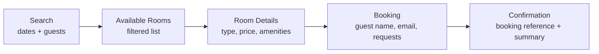

| Step | Frontend route | Backend endpoint |
|------|----------------|------------------|
| Search | `/` or `/rooms` (form) | - |
| Available Rooms | `/rooms?checkIn&checkOut&guests` | `GET /api/rooms/search` |
| Room Details | `/rooms/[roomId]?checkIn&checkOut&guests` | `GET /api/rooms/{roomId}` |
| Booking | `/booking/[roomId]?checkIn&checkOut&guests` | `GET /api/rooms/{roomId}` (to render), `POST /api/reservations` (submit) |
| Confirmation | `/booking/confirmation/[reference]` | `GET /api/reservations/{reference}` |

---

## Section 2 - Technology Stack

| Concern | Technology | Version (as in repo) | Notes |
|---------|-----------|----------------------|-------|
| Frontend framework | Next.js (App Router) | `next` 16.3.3 | React Server Components + selective Client Components |
| UI runtime | React | 19.2.8 | |
| Frontend language | TypeScript | 5.x (`typescript ^5`) | `tsc --noEmit` type-check gate |
| Styling | Tailwind CSS | v4 (`tailwindcss ^4`, `@tailwindcss/postcss`) | Utility-first, mobile-first; design tokens in `globals.css` |
| Fonts | `next/font/google` (Geist, Geist Mono) | - | Self-hosted at build time |
| Backend framework | ASP.NET Core Web API (controllers) | .NET 10 (`net10.0`) | Thin controllers + middleware |
| Backend language | C# | 13 / .NET 10 | Nullable enabled, implicit usings |
| ORM | Entity Framework Core | 10.0.11 | Code-first, migrations, owned types, value converters |
| Database | SQLite | via `Microsoft.EntityFrameworkCore.Sqlite` 10.0.11 | Single file `staysphere.db`, WAL mode |
| API docs | Swashbuckle (Swagger UI) | 10.2.3 | Development environment only, at `/swagger` |
| Backend tests | xUnit | 2.9.3 | + `Microsoft.AspNetCore.Mvc.Testing` for API tests |
| Frontend tests | Vitest + React Testing Library | Vitest 3.2.7, RTL 16.3.3 | `jsdom`, `@testing-library/user-event` |
| E2E tests | Playwright | *not yet implemented* | Named as the next step in `Docs/testing.md` |

### Deployment assumptions

There is **no deployment pipeline, container, or IaC in the repository.** What can be
stated from configuration:

* The frontend calls the API **directly from both the Next.js server (during SSR of
  Server Components) and the browser (for the booking POST)**. The API base URL is
  configured via `NEXT_PUBLIC_API_BASE_URL` (`.env.example` -> `http://localhost:5276`;
  `src/lib/config.ts` default `http://localhost:7265`). Because the value is
  `NEXT_PUBLIC_`, it is exposed to the browser bundle.
* Backend dev URLs: `http://localhost:5276` and `https://localhost:7265`
  (`launchSettings.json`).
* CORS: the API allows origins from `Cors:AllowedOrigins` (default
  `http://localhost:3000`, the Next.js dev server) with any header/method.
* Database connection string `Data Source=staysphere.db` (`appsettings.json`), a
  file relative to the API content root.
* Migrations and seeding run automatically on API startup
  (`DatabaseInitializer.InitializeAsync`).

A production deployment would host the API behind HTTPS, point the frontend at its
public URL, and (per `Docs/decisions.md`) move the same EF model to
PostgreSQL/SQL Server. No application code change is required for that swap.

---

## Section 3 - Overall System Architecture

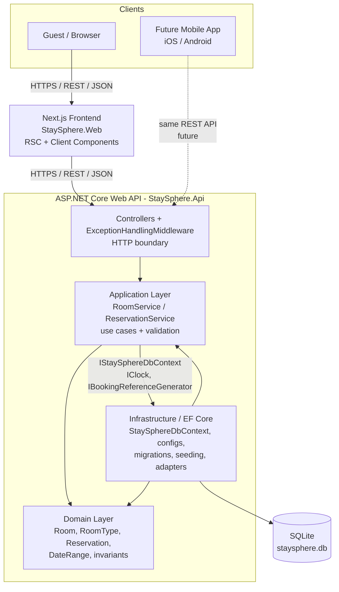

What the diagram communicates:

* **No client touches the database.** Only `StaySphere.Infrastructure` opens a
  connection to SQLite.
* **The backend owns all business rules.** Availability, capacity, date-overlap,
  pricing, and reference generation live in the Application/Domain layers, never in
  the frontend.
* **The REST API is the single boundary** between any client and the backend. The
  contract is plain JSON with camelCase properties and calendar-date strings.
* **A future mobile client uses the exact same API.** The frontend has no privileged
  backend access and no shared server code with the API.

Dependency arrows inside the backend: `Api -> Application -> Domain`, and
`Infrastructure -> Application` + `Infrastructure -> Domain`. `Infrastructure -> Application`
is the inverted arrow that keeps the Domain free of persistence concerns
(the `DbContext` implements an interface *declared* in Application).

---

## Section 4 - Frontend Architecture

### Framework model

Next.js **App Router** with the `src/app` directory. Route files are **async React
Server Components** by default; interactivity is opted into with `"use client"`.

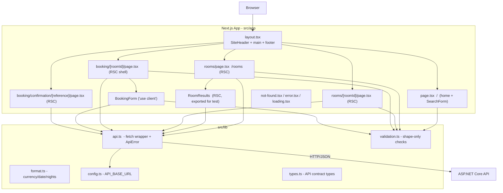

### Route / page structure

| Route | File | Component kind | Responsibility |
|-------|------|----------------|----------------|
| `/` | `app/page.tsx` | Server | Value proposition + `SearchForm` + "how it works" |
| `/rooms` | `app/rooms/page.tsx` | Server (async) | Parse & validate query string, render `SearchForm` (compact), stream `RoomResults` inside `<Suspense>` |
| `/rooms` results | `RoomResults` (named export in the route file) | Server (async) | `await searchRooms(criteria)`, render grid / empty / error |
| `/rooms/[roomId]` | `app/rooms/[roomId]/page.tsx` | Server (async) | `await getRoom(roomId)`, render details + "Book this room" CTA, capacity guard, 404 via `notFound()` |
| `/booking/[roomId]` | `app/booking/[roomId]/page.tsx` | Server (async) | Validate stay params, `await getRoom`, render stay summary + price breakdown + `BookingForm`; blocks over-capacity |
| `/booking/confirmation/[reference]` | `app/booking/confirmation/[reference]/page.tsx` | Server (async) | `await getReservation(reference)`, render confirmation; 404 via `notFound()` |
| any | `app/not-found.tsx`, `app/error.tsx` | - | Global not-found and error-boundary UI |
| per section | `app/**/loading.tsx` | - | Accessible loading fallbacks for the route segment |

### Server vs Client Components

* **Server Components (default):** every `page.tsx`. Data fetching (`searchRooms`,
  `getRoom`, `getReservation`) happens on the Next.js server during render. These
  GETs are server-to-API calls; results are HTML-streamed to the browser.
* **Client Components (`"use client"`):**
  * `SearchForm` - controlled inputs, client-side validation, `router.push` to
    `/rooms?...`.
  * `BookingForm` - the only component that performs a **browser-side** API call
    (`POST /api/reservations`), manages submission state, maps server errors back to
    fields, and prevents double submission.
  * `app/error.tsx` - error boundary with a `reset()` action.
* **Presentational components** (`RoomCard`, `RoomImage`, `AmenityList`,
  `PriceBreakdown`, `Alert`, `FormField`, `Spinner`, `SiteHeader`) are server-render
  friendly and take plain props.

### API client (`src/lib/api.ts`)

A single `request<T>()` wrapper around `fetch`:

* Prepends `API_BASE_URL`, sets `Accept: application/json`, `cache: "no-store"`
  (availability is volatile - never serve a cached copy).
* On a thrown `fetch` (offline/DNS) -> `ApiError(status = 0, code = "Network")`.
* On a non-OK response -> parses the error envelope and throws
  `ApiError(status, body.error, body.message, body)` carrying `fieldErrors`
  (`body.errors`) and `traceId`.
* `204` -> `undefined`.
* Exposes typed calls: `searchRooms`, `getRoom`, `createReservation`,
  `getReservation`, plus `firstFieldErrors()` to flatten field errors for form
  display.

`ApiError` provides `isNotFound` / `isConflict` / `isValidation` / `isNetwork`
helpers so callers branch on meaning, not raw numbers.

### Form handling & client-side validation

* `src/lib/validation.ts` - **shape-only** checks (`validateSearch`,
  `validateBooking`): required fields, date format, `checkOut > checkIn`, guest count
  `1..10`, email pattern, special-requests length `<= 1000`. It explicitly documents
  that the backend remains authoritative for every business rule (availability,
  capacity, past-date at booking time).
* `SearchForm` validates then navigates via query string (URL is the source of truth
  for a search - shareable, refresh-safe). `allowPastCheckIn` is `true` when parsing
  a URL (don't hard-fail a shared link) and `false` in the form.
* `BookingForm` validates locally, calls `createReservation`, and on success sets
  status `done` and pushes to the confirmation route (button stays disabled through
  navigation). On `ApiError` it distinguishes 409 (dedicated "just booked" alert),
  400 field errors (mapped onto inputs), 404, and generic/network failures.

### UI states handled

| State | Where |
|-------|-------|
| Loading | per-route `loading.tsx`, `<Suspense>` fallback with `Spinner`, `aria-busy` on the booking form |
| Success | results grid, confirmation page |
| Empty results | `/rooms` -> `Alert` "No rooms available" echoing dates/guests |
| Validation error (client) | inline `FormField` errors; `/rooms` "Check your search" list |
| API error | `Alert variant="error"` with the server message + recovery hint |
| Unavailable room / over capacity | details & booking pages block the CTA with an explanation |
| Booking conflict (409) | `BookingForm` "This room was just booked by someone else" + re-search link |
| Submission in flight | disabled button, "Confirming your booking..." spinner |
| Not found | `notFound()` -> `app/not-found.tsx` |

### Styling

Tailwind CSS v4 utilities, mobile-first (single-column layouts widen at `sm`/`lg`).
Semantic color tokens (`bg-surface`, `text-muted`, `bg-brand`, `border-border`) are
defined once in `globals.css`. Accessibility: `getByRole`/label-driven markup,
`role="alert"`/`role="status"` on `Alert`, focus management for error summaries in
`BookingForm`.

---

## Section 5 - Backend Architecture

Four projects in a lightweight layered architecture (a fifth, `StaySphere.Tests`,
holds the automated suite). Deliberately **no** CQRS, MediatR, generic repository, or
unit-of-work wrapper - see Section 18.

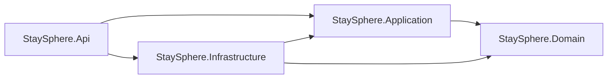

`Api` references `Infrastructure` only as the **composition root** (to register
services in DI at startup); it never calls infrastructure types directly.

### StaySphere.Domain

* **Responsibility:** the business model and its invariants.
* **Owns:** `RoomType`, `Room`, `Amenity`, `RoomTypeAmenity`, `Reservation`,
  `ReservationStatus`, the `DateRange` value object, and the `DomainException`
  hierarchy (`BusinessRuleViolationException` -> 400,
  `RoomUnavailableException` -> 409).
* **Must NOT own:** persistence, HTTP, EF Core, DI, JSON. The `.csproj` has **zero
  package references** - BCL only.
* **Dependencies:** none.

### StaySphere.Application

* **Responsibility:** use-case orchestration and request validation.
* **Owns:** `RoomService` (`SearchAsync`, `GetByIdAsync`), `ReservationService`
  (`CreateAsync`, `GetByReferenceAsync`), their interfaces, the DTO/command records
  (`RoomSearchQuery`, `RoomDto`, `CreateReservationCommand`,
  `ReservationConfirmation`), the `IStaySphereDbContext` persistence abstraction,
  `IClock`, `IBookingReferenceGenerator`, `ValidationException` / `NotFoundException`,
  and the `ValidationErrors` accumulator.
* **Must NOT own:** HTTP concerns, the SQLite provider, EF entity configuration,
  concrete `DbContext`.
* **Dependencies:** `Domain`; `Microsoft.EntityFrameworkCore` (for `DbSet<>`,
  `SaveChangesAsync`, `IDbContextTransaction` on the interface),
  `Microsoft.Extensions.Logging.Abstractions`,
  `Microsoft.Extensions.DependencyInjection.Abstractions`. It does **not** reference
  `Infrastructure` or `Microsoft.EntityFrameworkCore.Sqlite`.

### StaySphere.Infrastructure

* **Responsibility:** everything technology-specific.
* **Owns:** `StaySphereDbContext` (implements `IStaySphereDbContext`), the five
  `IEntityTypeConfiguration<>` classes, `MoneyConverter`, EF migrations + model
  snapshot, `DatabaseInitializer`, `JsonRoomCatalogSeeder`,
  `StaySphereDbContextFactory` (design-time), `SystemClock`,
  `BookingReferenceGenerator`, and the `BEGIN IMMEDIATE` transaction implementation.
* **Must NOT own:** use-case logic, validation rules, HTTP.
* **Dependencies:** `Application`, `Domain`, `Microsoft.EntityFrameworkCore.Sqlite`,
  `Microsoft.EntityFrameworkCore.Design`.

### StaySphere.Api

* **Responsibility:** the HTTP boundary and process host.
* **Owns:** `RoomsController`, `ReservationsController` (thin),
  `ExceptionHandlingMiddleware`, the `CreateReservationRequest` request contract and
  `ApiErrorResponse` envelope, `Program.cs` DI composition, CORS, Swagger,
  `InvalidModelStateResponseFactory`, and the startup call to
  `DatabaseInitializer.InitializeAsync()`.
* **Must NOT own:** reservation business rules, date-overlap logic, database queries,
  complex orchestration.
* **Dependencies:** `Application`, `Infrastructure` (composition only).

### Layer responsibility summary

| Layer | Owns | Does NOT own |
|-------|------|--------------|
| Api | HTTP binding, status codes, error envelope, Swagger, DI wiring, startup | business rules, queries |
| Application | use cases, request validation, DTO mapping, the availability query (as LINQ), transaction choreography | HTTP, EF provider, entity mapping |
| Domain | invariants, `DateRange` overlap rule, capacity rule, pricing, reservation lifecycle | persistence, framework code |
| Infrastructure | `DbContext`, configs, migrations, seeding, SQLite transaction strategy, clock & reference adapters | use-case logic, validation |

### How OOP / SOLID actually show up in the code

This is described from the implementation, not asserted from the presence of
interfaces.

* **Encapsulation / rich domain (not anemic):**
  * `Reservation` has a private parameterless constructor (EF only) and **private
    setters**. The single way to create one is the static factory
    `Reservation.Create(...)`, which enforces every invariant (guest count `>= 1` and
    `<= RoomType.MaxGuests`, non-blank name/email/reference, room type loaded) and
    snapshots `TotalPrice = RoomType.CalculatePrice(nights)`. An invalid reservation
    is unconstructable.
  * `Room`, `RoomType`, `Amenity`, `RoomTypeAmenity` guard their constructors
    (blank name, non-positive price/capacity, null relations) and expose collections
    as `IReadOnlyCollection<>` over private backing lists.
  * `DateRange` is immutable, validates `end > start` on construction, and computes
    `Nights`.
* **Single Responsibility:**
  * `DateRange` is the *only* place the half-open overlap rule
    (`Start < other.End && other.Start < End`) is defined.
  * `ExceptionHandlingMiddleware` is the only place exceptions become HTTP.
  * `MoneyConverter` is the only place money <-> integer-cents conversion lives.
  * `BookingReferenceGenerator` is the only place the reference format is defined.
  * Controllers do HTTP; services do use cases; `DbContext` does persistence.
* **Open/Closed:** the exception -> `(status, code, message)` mapping is a single
  `switch` expression in the middleware. A new domain error type is one new arm; no
  controller changes. New business rules can be added inside a service or the domain
  factory without touching the HTTP layer.
* **Liskov / Interface Segregation:** interfaces are small and single-purpose
  (`IClock` = 2 members, `IBookingReferenceGenerator` = 1 member,
  `IRoomService` / `IReservationService` = 2 members each). `IStaySphereDbContext`
  exposes exactly the five `DbSet`s plus `SaveChangesAsync` and
  `BeginImmediateTransactionAsync` - not the whole `DbContext` surface.
* **Dependency Inversion - where it genuinely earns its place:**
  * `ReservationService` depends on `IClock` and `IBookingReferenceGenerator`;
    production wires `SystemClock` / `BookingReferenceGenerator`, tests wire
    `FixedClock` / `FakeBookingReferenceGenerator`. These are real substitutable
    seams (wall-clock time, CSPRNG output).
  * `IStaySphereDbContext` inverts the persistence dependency so the Domain never
    sees EF and services can run against a test database.
  * `IRoomService` / `IReservationService` have a single implementation each; the
    interface here is a pragmatic DI/testing seam, **not** polymorphism. That is a
    deliberate, minimal choice, consistent with "do not create an interface for
    every class."

---

## Section 6 - Domain Model

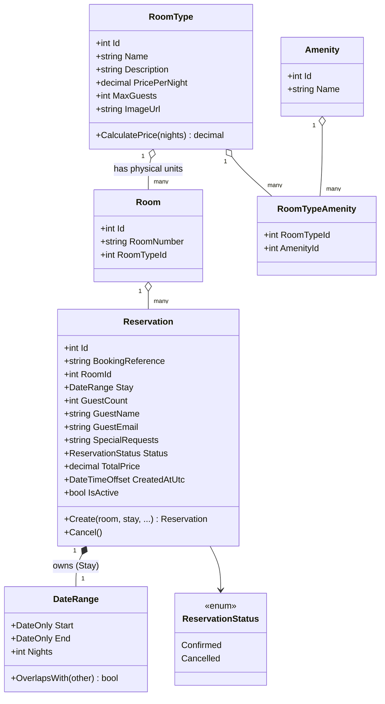

### Concept relationships

```
RoomType
  ├── Room 101, Room 102, Room 103 ...   (physical, bookable units)
  └── Amenities (via RoomTypeAmenity join)

Room
  └── Reservations (0..*)                (each for a DateRange)
```

### Where behaviour lives

| Concept | Behaviour it carries |
|---------|----------------------|
| `RoomType` | `CalculatePrice(nights)` (`nights <= 0` -> throw); holds the shared price / capacity / description / amenities / image for every room of the type |
| `Room` | identity (`RoomNumber`) + its type + its reservation history; nothing price-related |
| `DateRange` | range validity + the half-open overlap rule; `Nights` |
| `Reservation` | `Create(...)` factory enforcing all booking invariants + price snapshot; `Cancel()`; `IsActive` |
| `Amenity` / `RoomTypeAmenity` | many-to-many link between a type and its features |

### Why a reservation references a physical `Room`, not a `RoomType`

Availability is a property of a **physical inventory unit**. If reservations pointed
at a room *type*, the system could not tell whether "Deluxe King" still has a free
room on given dates - only that *some* Deluxe King is booked. By booking `Room 201`
specifically:

* availability is computed per unit (`Room 6` booked does not block `Room 7` of the
  same type - asserted by tests);
* the search returns one result per free physical room, and a client may group by
  `roomTypeId` if it wants a category listing;
* `Reservation.TotalPrice` is snapshotted at booking time from `RoomType.PricePerNight`,
  so a later price change does not rewrite history.

---

## Section 7 - Database / Persistence Design

### Engine & access

* **SQLite**, single file (`Data Source=staysphere.db`), WAL journal mode enabled at
  startup (`PRAGMA journal_mode=WAL;`) so readers don't block the single writer.
* **EF Core 10** code-first. `StaySphereDbContext` (sealed) exposes five `DbSet`s and
  applies all `IEntityTypeConfiguration<>` classes via
  `ApplyConfigurationsFromAssembly`.
* Migrations run automatically on startup (`Database.MigrateAsync()`), followed by
  JSON room seeding and sample-reservation seeding.

### Relationship diagram

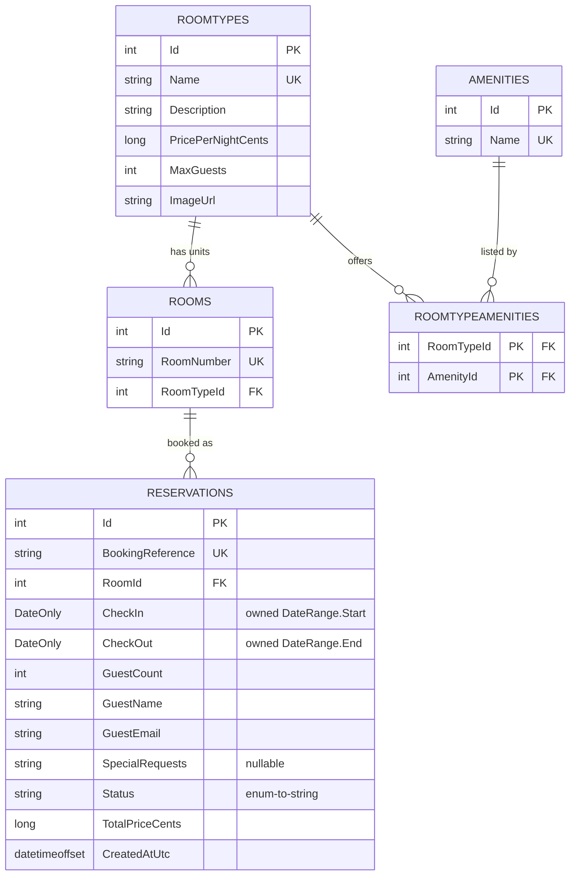

### Mapping choices

| Choice | Detail | Reason |
|--------|--------|--------|
| Owned type | `Reservation.Stay` (`DateRange`) mapped to `CheckIn` / `CheckOut` columns on `Reservations`; navigation required | the value object is used verbatim in the availability LINQ and translates to SQL |
| Value converter | `decimal` money <-> `long` cents (`MoneyConverter`), columns `*Cents` | SQLite has no decimal; EF's default maps decimal to TEXT, which sorts lexicographically and breaks `ORDER BY price` |
| Enum conversion | `ReservationStatus` stored as string (`HasConversion<string>()`, max 20) | readable rows; stable against enum reordering |
| Keys | integer identity everywhere; `RoomTypeAmenity` has a composite key `(RoomTypeId, AmenityId)` | natural join key |
| Public identifier | `BookingReference` (`STAY-` + 8 Crockford base32), unique index | the public id must not be a guessable sequential DB id |

### Indexes

| Index | Table | Purpose |
|-------|-------|---------|
| `IX_Reservations_BookingReference` (unique) | Reservations | confirmation lookup + reference-collision check |
| `IX_Reservations_RoomId_Status` | Reservations | first-stage filter of the availability query (room + confirmed) |
| `IX_Reservations_CheckIn_CheckOut` | Reservations | date-interval range scan for overlap |
| `IX_Rooms_RoomNumber` (unique) | Rooms | inventory integrity |
| `IX_Rooms_RoomTypeId` | Rooms | join to type |
| `IX_RoomTypes_Name` (unique), `IX_Amenities_Name` (unique) | RoomTypes / Amenities | catalog integrity, idempotent seeding |
| `IX_RoomTypeAmenities_AmenityId` | RoomTypeAmenities | reverse navigation |

### Constraints & referential actions

* `Rooms.RoomTypeId -> RoomTypes.Id` : `ON DELETE RESTRICT`
* `Reservations.RoomId -> Rooms.Id` : `ON DELETE RESTRICT` (a room with history cannot
  be deleted out from under its reservations)
* `RoomTypeAmenities -> RoomTypes` / `-> Amenities` : `ON DELETE CASCADE`
* All string columns have explicit `HasMaxLength`; `GuestEmail` 320, `GuestName` 200,
  `SpecialRequests` 1000, `BookingReference` 30.

### Seed data

* **Catalog** (`RoomType` x4, `Room` x8, `Amenity` x10, `RoomTypeAmenity` links) ships
  in the migration via `HasData` - deterministic, file-independent.
* **Extra rooms** (`JsonRoomCatalogSeeder`) load from `Data/room-seed.json` after
  migration. Idempotent: a record is inserted only if no row with its explicit `id`
  exists. Malformed files/records are logged and skipped, never fatal. Kept out of
  migrations because migrations must be deterministic.
* **Sample reservations** are **date-relative** (`today + n`), which `HasData` cannot
  express, so `DatabaseInitializer` inserts a couple of them on first startup (only
  when the `Reservations` table is empty) to make availability filtering visible in
  a fresh database.

### How persistence stays separated from business logic

* The Domain has no EF dependency; entities are plain classes with invariants.
* Application services depend on **`IStaySphereDbContext`**, an interface declared in
  the Application layer and implemented by the `DbContext` in Infrastructure. The
  dependency arrow therefore points `Infrastructure -> Application`.
* Entity configuration (column types, indexes, converters, owned types) lives
  entirely in `Infrastructure/Persistence/Configurations`, invisible to callers.
* Query logic (the availability predicate) is expressed as LINQ in the service and
  translated to SQL by EF - nothing is filtered in memory.

### SQLite limitations relevant to concurrency / scale

(from `Docs/decisions.md`, reproduced because they bound the design)

* **Single writer.** SQLite serializes all writes with a database-level lock;
  throughput is one write transaction at a time.
* **No `SELECT ... FOR UPDATE`.** No row locking; the booking guard relies on the
  whole-database write lock taken by `BEGIN IMMEDIATE`.
* **Busy timeout, not a queue.** Concurrent writers wait up to the connection
  `Default Timeout` (30 s) then fail with `SQLITE_BUSY`. `CreateAsync` treats a
  `DbUpdateException` at commit as a `409`, not a `500`.
* **WAL** helps read concurrency only; it does not change the single-writer rule.
* Money and dates are compared on converted integer-cents and ISO `yyyy-MM-dd` text
  so ordering and range predicates are correct.
* A production move to PostgreSQL/SQL Server would keep the same EF model and replace
  `BEGIN IMMEDIATE` with a range/exclusion constraint or `SERIALIZABLE` + retry.
  Application/Domain code would not change.

---

## Section 8 - API Design

Base path `/api`. All responses `application/json`; camelCase properties; dates are
`yyyy-MM-dd` calendar strings. Every non-2xx response uses the `ApiErrorResponse`
envelope:

```json
{ "status": 409, "error": "BookingConflict", "message": "...", "errors": null, "traceId": "0HN..." }
```

`errors` (a `field -> string[]` map) is populated only for `ValidationFailed` (400).

### GET /api/rooms/search

| | |
|---|---|
| Purpose | Physical rooms available for the **entire** range with capacity `>= guests` |
| Query params | `checkIn` (DateOnly, required), `checkOut` (DateOnly, required, after `checkIn`), `guests` (int, required, `>= 1`) |
| 200 | `RoomDto[]`, possibly empty, ordered by price then room number. `RoomDto` = `{ roomId, roomNumber, roomTypeId, roomType, description, pricePerNight, maxGuests, amenities[], imageUrl }` |
| 400 | missing/invalid params (`ValidationFailed`, with `errors`) |

### GET /api/rooms/{roomId}

| | |
|---|---|
| Route constraint | `{roomId:int}` |
| Purpose | Full details for one physical room |
| 200 | a single `RoomDto` |
| 404 | `NotFound` - room does not exist (also 404 for a non-integer id via the route constraint) |

### POST /api/reservations

| | |
|---|---|
| Purpose | Create a reservation; availability is **re-checked authoritatively** here |
| Request body | `CreateReservationRequest` = `{ roomId:int, checkIn:DateOnly?, checkOut:DateOnly?, guestCount:int, guestName:string?, guestEmail:string?, specialRequests:string? }` |
| Validation | `roomId` must exist; `checkIn` required & not in the past; `checkOut` required & after `checkIn`; `1 <= guestCount <= RoomType.MaxGuests`; `guestName` required, `>= 2` chars; `guestEmail` required & valid (`MailAddress`); `specialRequests` `<= 1000` chars |
| 201 | `ReservationConfirmation` body + `Location` header -> `GET /api/reservations/{reference}` (via `CreatedAtAction`) |
| 400 | `ValidationFailed` (field errors) or `BusinessRuleViolation` |
| 404 | `NotFound` - room id does not exist |
| 409 | `BookingConflict` - room not available for the dates (overlap found at re-check, or `DbUpdateException` at commit) |

`ReservationConfirmation` = `{ bookingReference, guestName, guestEmail,
specialRequests, roomId, roomNumber, roomType, description, amenities[], imageUrl,
checkIn, checkOut, nights, guestCount, pricePerNight, totalPrice, status,
createdAtUtc }`.

### GET /api/reservations/{reference}

| | |
|---|---|
| Purpose | Retrieve a confirmation by public reference (e.g. `STAY-MJXR4R8V`) |
| 200 | `ReservationConfirmation` (same shape as the POST response) |
| 404 | `NotFound` - unknown reference (lookup is case-sensitive / ordinal) |

### GET / (Development only)

Redirects to `/swagger`. Excluded from the API description. Not present outside the
Development environment.

---

## Section 9 - Frontend -> Backend Communication Flow

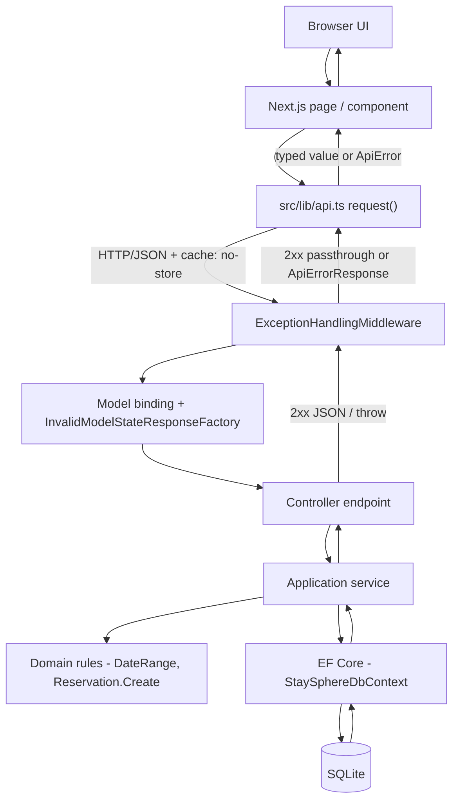

| Step | Responsibility |
|------|----------------|
| Next.js page / component | Decide *what* to fetch; render loading/empty/error/success. GETs run in a Server Component during SSR; the booking POST runs in the `BookingForm` Client Component in the browser. |
| `api.ts request()` | Build URL from `API_BASE_URL`, set headers, `cache: "no-store"`, serialize body, parse response, convert failures into `ApiError` (including status 0 for network errors). |
| `ExceptionHandlingMiddleware` | Wrap the whole pipeline; translate any thrown exception into `(status, error, message, errors)` + the `ApiErrorResponse` envelope; log at the right level (500 -> error, 409 -> warning, else -> information). |
| Model binding / `InvalidModelStateResponseFactory` | Bind query/body; on binding failure emit the **same** envelope with `error: "ValidationFailed"`. |
| Controller | Map the request contract to an Application command/query, call the service, translate the result to `Ok(...)` / `CreatedAtAction(...)`. No business logic. |
| Application service | Validate input (accumulate field errors -> `ValidationException`), orchestrate: load entities, check capacity, open the transaction, re-check availability, call the domain factory, persist, map to a DTO. |
| Domain | Enforce invariants: `DateRange` (range validity + overlap), `Reservation.Create` (capacity, required fields, price snapshot). |
| EF Core | Translate LINQ (capacity filter, half-open overlap predicate, ordering, owned-type columns) to SQL; track and save changes; manage the transaction. |
| SQLite | Execute SQL under a single-writer lock; `BEGIN IMMEDIATE` holds the RESERVED lock for the booking critical section. |

**Where each concern happens:**

* **Client-side validation:** `src/lib/validation.ts` (shape only, fast feedback).
* **Authoritative validation:** Application services + Domain factory.
* **Business rules execute:** Application services (`RoomService`,
  `ReservationService`) and Domain (`DateRange`, `Reservation`, `RoomType`).
* **Database queries:** only inside Application services via `IStaySphereDbContext`,
  executed by EF Core in Infrastructure.
* **Errors -> HTTP:** exclusively in `ExceptionHandlingMiddleware` (+ the
  model-state factory for binding failures).

---

## Section 10 - Detailed Reservation Flow

Complete path from the guest pressing **Confirm booking** to the confirmation screen.

```mermaid
sequenceDiagram
    actor Guest
    participant UI as BookingForm (Client Component)
    participant AC as api.ts createReservation
    participant MW as ExceptionHandlingMiddleware
    participant CT as ReservationsController.Create
    participant SVC as ReservationService.CreateAsync
    participant DOM as Domain (DateRange, Reservation.Create)
    participant DB as StaySphereDbContext / EF Core
    participant SQL as SQLite

    Guest->>UI: fill name / email / requests, submit
    UI->>UI: validateBooking(form) (shape only)
    UI->>UI: guard: ignore if already submitting/done
    UI->>AC: createReservation({ roomId, checkIn, checkOut, guestCount, guestName, guestEmail, specialRequests })
    AC->>MW: POST /api/reservations (JSON, cache: no-store)
    MW->>CT: pipeline (model binding OK)
    CT->>SVC: CreateAsync(CreateReservationCommand)

    SVC->>SVC: ValidateRequest(command) -> ValidationErrors
    alt any field invalid
        SVC-->>MW: throw ValidationException
        MW-->>AC: 400 ValidationFailed + errors{}
        AC-->>UI: ApiError(isValidation) -> map to fields / summary
    end
    SVC->>DOM: new DateRange(checkIn, checkOut)
    SVC->>DB: Rooms.Include(RoomType.RoomTypeAmenities.Amenity).FirstOrDefault(id)
    DB->>SQL: SELECT room + type + amenities
    SQL-->>DB: row / none
    alt room not found
        SVC-->>MW: throw NotFoundException
        MW-->>AC: 404 NotFound
        AC-->>UI: ApiError(isNotFound) -> "start a new search"
    end
    alt guestCount exceeds RoomType.MaxGuests
        SVC-->>MW: throw ValidationException("guestCount")
        MW-->>AC: 400 ValidationFailed
    end

    SVC->>DB: BeginImmediateTransactionAsync()
    DB->>SQL: BEGIN IMMEDIATE  (RESERVED write lock)
    SVC->>DB: Reservations.Any(room matches, Status == Confirmed, half-open overlap with requested stay)
    DB->>SQL: SELECT EXISTS(overlap)
    SQL-->>DB: true / false
    alt overlapping confirmed reservation exists
        SVC-->>MW: throw RoomUnavailableException
        MW-->>AC: 409 BookingConflict
        AC-->>UI: ApiError(isConflict) -> "just booked by someone else"
    end

    SVC->>SVC: GenerateUniqueReferenceAsync() (STAY- + 8 base32, retry up to 5x, DB uniqueness check)
    SVC->>DOM: Reservation.Create(room, stay, guests, name, email, requests, reference, clock.UtcNow)
    DOM-->>SVC: Confirmed reservation, TotalPrice = RoomType.CalculatePrice(nights)
    SVC->>DB: Reservations.Add(reservation); SaveChangesAsync()
    DB->>SQL: INSERT INTO Reservations ...
    SVC->>DB: transaction.CommitAsync()
    DB->>SQL: COMMIT  (lock released)
    alt DbUpdateException at save/commit
        SVC-->>MW: throw RoomUnavailableException
        MW-->>AC: 409 BookingConflict
    end

    SVC-->>CT: ReservationConfirmation.FromEntity(reservation)
    CT-->>MW: 201 Created + Location: /api/reservations/{reference}
    MW-->>AC: 201 + confirmation JSON
    AC-->>UI: ReservationConfirmation
    UI->>UI: status = "done"
    UI->>Guest: router.push(/booking/confirmation/{bookingReference})
    Note over Guest,SQL: Confirmation page (Server Component) then calls GET /api/reservations/{reference} and renders the summary
```

Key classes / methods referenced: `BookingForm.handleSubmit`,
`createReservation` (`src/lib/api.ts`), `ReservationsController.Create`,
`ReservationService.CreateAsync`, `ReservationService.ValidateRequest`,
`ReservationService.GenerateUniqueReferenceAsync`,
`IStaySphereDbContext.BeginImmediateTransactionAsync`,
`Reservation.Create`, `RoomType.CalculatePrice`,
`ReservationConfirmation.FromEntity`.

---

## Section 11 - Reservation Validation Flow

The order of checks inside `ReservationService.CreateAsync` and the HTTP result each
failure produces.

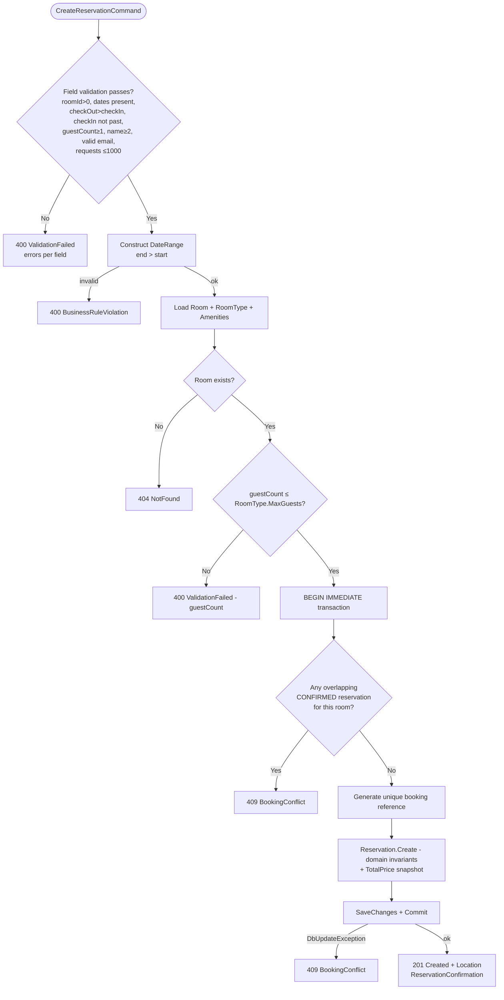

Notes:

* Field validation is **accumulated** - one response can list several field errors
  (`ValidationErrors.ThrowIfAny()` -> `ValidationException`).
* `checkIn` not-in-the-past is enforced at **booking time** against `IClock.Today`
  (the frontend allows past dates only when parsing a shared search URL).
* Capacity is checked twice by design: once in the service (fast, precise 400 on
  `guestCount`) and again as an invariant inside `Reservation.Create`
  (`BusinessRuleViolationException`) so the entity can never be built inconsistent.

---

## Section 12 - Availability / Date-Conflict Logic

### The rule

A stay is the half-open interval **`[CheckIn, CheckOut)`** - check-in day included,
check-out day excluded. Two ranges overlap iff:

```
existing.Start < requested.End  AND  requested.Start < existing.End
```

Adjacent ranges (one ends the day the other starts) **do not** overlap. Only
`Status == Confirmed` reservations are considered; `Cancelled` ones never block.

### Single definition

The rule is defined once, in `DateRange.OverlapsWith` (Domain):

```csharp
public bool OverlapsWith(DateRange other) =>
    Start < other.End && other.Start < End;
```

The same predicate is expressed as LINQ (and translated to SQL by EF Core) in two
places, both in the Application layer:

* `RoomService.SearchAsync` - excludes any room with
  `reservation.Status == Confirmed && reservation.Stay.Start < stay.End && stay.Start < reservation.Stay.End`.
* `ReservationService.CreateAsync` - the authoritative `AnyAsync(...)` re-check inside
  the transaction, using the identical expression.

Nothing is evaluated in memory; the `Stay` owned type maps to the `CheckIn` /
`CheckOut` columns so the predicate runs in SQLite.

### Worked examples

Existing confirmed stay: **Sep 10 -> Sep 13**.

| Requested | Evaluation | Result |
|-----------|-----------|--------|
| Sep 13 -> Sep 15 | `10 < 15` true AND `13 < 13` **false** | **Available** (adjacent) |
| Sep 12 -> Sep 15 | `10 < 15` true AND `12 < 13` true | **Conflict** |
| Sep 08 -> Sep 10 | `10 < 10` **false** | Available (adjacent) |
| Sep 10 -> Sep 13 | `10 < 13` true AND `10 < 13` true | Conflict (exact) |
| Sep 08 -> Sep 11 | `10 < 11` true AND `8 < 13` true | Conflict (overlap start) |
| Sep 11 -> Sep 12 | `10 < 12` true AND `11 < 13` true | Conflict (containment) |
| Sep 05 -> Sep 08 | `10 < 8` **false** | Available |

### Frontend does NOT own this

`src/lib/validation.ts` only checks input *shape* (`checkOut > checkIn`, guest count
range, email format). It has no availability logic and explicitly documents that the
backend is authoritative. Room detail / booking pages show "Availability is confirmed
when you complete the booking."

---

## Section 13 - Double-Booking / Concurrency

### The stale-search problem

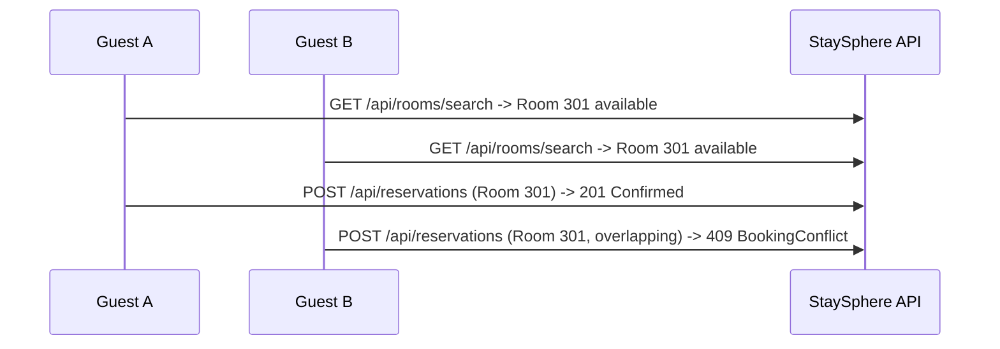

A search result is a **snapshot**. Between search and booking another guest can take
the room. The API therefore never trusts a prior search - it re-checks at booking
time.

### The implemented guard

`ReservationService.CreateAsync`:

1. `await using var transaction = await _db.BeginImmediateTransactionAsync(ct);`
   `StaySphereDbContext.BeginImmediateTransactionAsync` opens the underlying
   `SqliteConnection` and calls
   `BeginTransaction(IsolationLevel.Serializable, deferred: false)` - i.e. SQLite
   **`BEGIN IMMEDIATE`** - then hands it to EF via `Database.UseTransactionAsync`.
   `BEGIN IMMEDIATE` takes the RESERVED write lock **up front**, so only one booking
   transaction is inside the critical section at a time; other writers wait on the
   busy timeout.
2. Inside the transaction: `Reservations.AnyAsync(overlap predicate)` - the
   authoritative availability check.
3. If an overlapping confirmed reservation exists -> `RoomUnavailableException`
   (409). Otherwise generate the reference, `Reservation.Create`, `Add`,
   `SaveChangesAsync`, `CommitAsync`.
4. A `DbUpdateException` at save/commit is also translated to
   `RoomUnavailableException` (409) rather than surfacing a 500.

### What SQLite guarantees here - and what it does not

**Guaranteed:** with `BEGIN IMMEDIATE`, the check-then-insert for a given room cannot
interleave with another booking's check-then-insert. The concurrency test
(`DoubleBookingConcurrencyTests`) races 6 threads (own connection each) for the same
room + dates and observes exactly **one 201 and five 409**, with exactly one
confirmed row afterwards; four disjoint-date bookings for one room all succeed.

**Not guaranteed / limitations (documented, not worked around):**

* SQLite has a **single writer** - throughput is one write transaction at a time.
* **No row locking / `SELECT ... FOR UPDATE`** - the guard depends on the
  database-level write lock.
* Under sustained heavy contention a losing writer could time out with `SQLITE_BUSY`
  (after the 30 s `Default Timeout`) instead of a clean 409.
* The concurrency test is timing-dependent - a strong smoke test, not a formal proof.
* There is **no distributed locking, Redis, or message broker**, by design and per
  the brief. A production RDBMS (PostgreSQL/SQL Server) would replace `BEGIN IMMEDIATE`
  with a range/exclusion constraint or `SERIALIZABLE` + retry; the
  Application/Domain code would be unchanged.

---

## Section 14 - Error Handling Flow

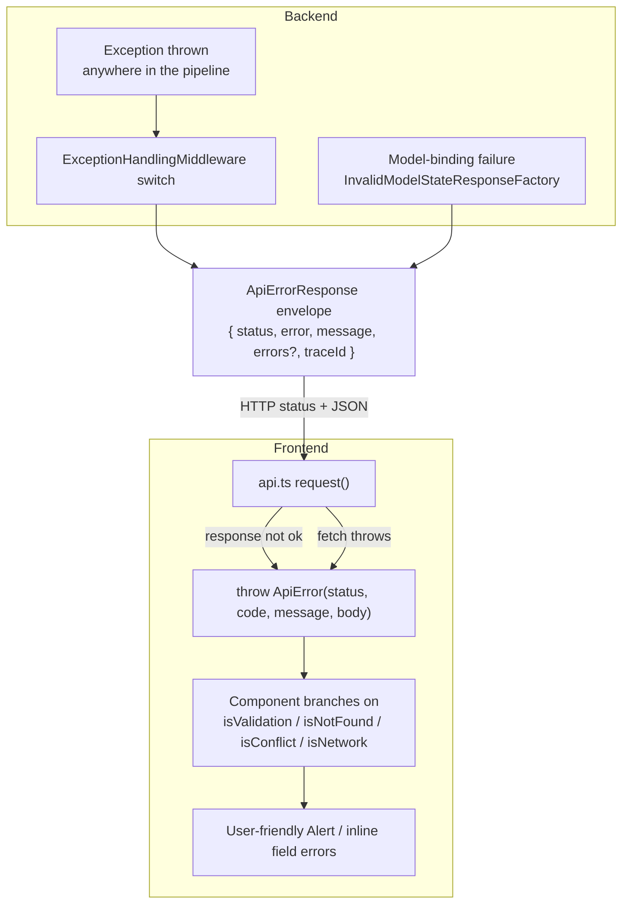

### Backend mapping (`ExceptionHandlingMiddleware`)

| Exception | HTTP | `error` code | Logged as |
|-----------|------|--------------|-----------|
| `ValidationException` | 400 | `ValidationFailed` (+ `errors`) | Information |
| `NotFoundException` | 404 | `NotFound` | Information |
| `RoomUnavailableException` | 409 | `BookingConflict` | Warning |
| other `DomainException` (`BusinessRuleViolationException`) | 400 | `BusinessRuleViolation` | Information |
| `OperationCanceledException` (client aborted) | 499 | `ClientClosedRequest` | Information |
| anything else | 500 | `ServerError` - generic message, **internal detail not leaked** | Error (with exception + traceId) |
| model-binding failure | 400 | `ValidationFailed` (+ `errors`) via `InvalidModelStateResponseFactory` | - |

Controllers contain **no try/catch**. Every response - success or failure - carries a
`traceId` (`HttpContext.TraceIdentifier`).

### Frontend handling (`src/lib/api.ts` + components)

| Situation | `ApiError` | UI |
|-----------|-----------|----|
| 400 with `errors` | `isValidation`, `fieldErrors` | `BookingForm` maps messages to `guestName` / `guestEmail` / `specialRequests`; non-field messages -> summary alert; `/rooms` -> "Check your search" |
| 404 | `isNotFound` | `notFound()` on detail/booking/confirmation pages; `BookingForm` -> "no longer available, start a new search" |
| 409 | `isConflict` | `BookingForm` -> dedicated "just booked by someone else" alert + re-search link; button re-enabled |
| 500 / other | generic | `Alert` with the server `message` + retry |
| network failure (fetch throws) | `status = 0`, `code = "Network"` | "Could not reach the StaySphere service..." |
| unexpected (non-`ApiError`) in a page | - | `app/error.tsx` boundary with "Try again" |

---

## Section 15 - End-to-End User Journey

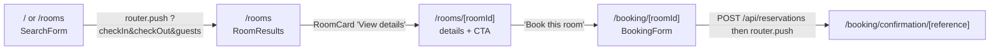

| User action | Frontend route / component | API call | Backend responsibility |
|-------------|----------------------------|----------|------------------------|
| Enter dates + guests, submit | `SearchForm` (client) on `/` or `/rooms` | none (navigates) | - |
| View results | `/rooms` -> `RoomResults` (RSC) | `GET /api/rooms/search?checkIn&checkOut&guests` | `RoomService.SearchAsync`: validate query, single SQL query filtering by `MaxGuests >= guests` and excluding overlapping confirmed reservations, order by price then room number, project `RoomDto` |
| Open a room | `RoomCard` link -> `/rooms/[roomId]?...` (RSC) | `GET /api/rooms/{roomId}` | `RoomService.GetByIdAsync`: load room + type + amenities or `NotFoundException` |
| Start booking | details "Book this room" -> `/booking/[roomId]?...` (RSC shell) | `GET /api/rooms/{roomId}` (to render summary) | same as above; page blocks if `guests > maxGuests` |
| Submit guest details | `BookingForm` (client) | `POST /api/reservations` | `ReservationService.CreateAsync`: validate, load room, capacity check, `BEGIN IMMEDIATE`, authoritative overlap re-check, generate reference, `Reservation.Create` (+ price snapshot), persist, commit -> `201` + `Location` |
| See confirmation | `/booking/confirmation/[reference]` (RSC) | `GET /api/reservations/{reference}` | `ReservationService.GetByReferenceAsync`: load reservation + room + type + amenities or `NotFoundException` |

Failure branches on the same journey: invalid search -> "Check your search" (no API
call); empty results -> "No rooms available"; unknown room/reference -> `notFound()`;
over-capacity -> blocked CTA; room taken between search and submit -> `409` ->
"just booked by someone else" + re-search; API down -> connectivity message.

---

## Section 16 - Testing Architecture

Tests exist for both tiers. Playwright E2E is **not yet implemented**.

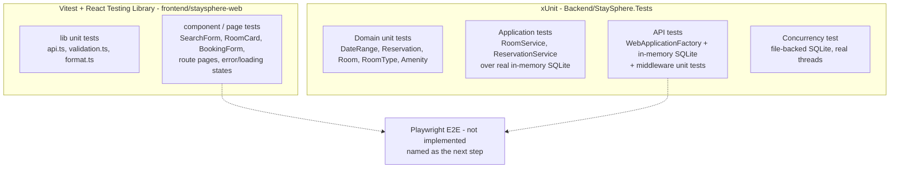

### Backend (`Backend/StaySphere.Tests`, xUnit) - ~175 tests

| Suite | Style | Proves |
|-------|-------|--------|
| `Domain/` (`DateRangeTests`, `ReservationTests`, `RoomTests`, `RoomTypeTests`, `AmenityAndRoomTypeAmenityTests`) | pure unit, no infrastructure | range validity, the half-open overlap matrix, `Reservation.Create` guards + price snapshot, constructor invariants, `CalculatePrice` |
| `Application/` (`RoomServiceSearchTests`, `RoomServiceGetByIdTests`, `ReservationServiceCreateTests`, `ReservationServiceConflictTests`, `ReservationServiceGetByReferenceTests`) | service + **real EF Core over in-memory SQLite**; `IClock` / `IBookingReferenceGenerator` faked | use-case orchestration, that the LINQ (capacity filter, overlap predicate, ordering, owned-type mapping) actually translates to SQL, validation field-by-field, the conflict matrix, the stale-search case |
| `Api/` (`RoomsEndpointsTests`, `ReservationsEndpointsTests`, `ExceptionHandlingMiddlewareTests`) | full pipeline via `WebApplicationFactory` + in-memory SQLite + fixed clock | routing, model binding, status codes, the error envelope, camelCase JSON, persistence + retrieval, the exception->status table |
| `Concurrency/` (`DoubleBookingConcurrencyTests`) | real threads, own connection each, **file-backed** SQLite | `BEGIN IMMEDIATE` + re-check yields exactly one winner under a race; disjoint dates all succeed |

`TestSupport/` provides `SqliteTestDatabase`, `StaySphereApiFactory`, `FixedClock`,
`FakeBookingReferenceGenerator`, `ReservationSeeder`, `SeededCatalog`, `Build`. The
only production change made for testing was `tsconfig.json` on the frontend and test
project references - documented in `Docs/testing.md`.

### Frontend (`frontend/staysphere-web`, Vitest) - ~106 tests across ~17 files

* **`src/lib` unit tests:** `format.test.ts`, `validation.test.ts`, `api.test.ts`
  (URL/verb/body/headers, envelope -> `ApiError`, network -> status 0, `204`,
  `firstFieldErrors`).
* **Component / page tests:** `SearchForm`, `RoomCard`, `RoomImage`, `AmenityList`,
  `PriceBreakdown`, `Alert`, `BookingForm` (highest priority - conflict, field-error
  mapping, duplicate-submission prevention, in-flight, 404/500/network), and the
  route `page.tsx` files rendered by awaiting the async component. `RoomResults` is
  exported so the streamed results section can be tested directly.
* **Boundary mocked:** only `src/lib/api.ts` request functions; the real `ApiError`
  and `firstFieldErrors` are kept. `next/link` and `next/navigation` are stubbed.

### Testing boundary

```
Frontend UI behaviour        -> Vitest + RTL (component/page level, network mocked)
Backend business behaviour    -> xUnit Domain (pure) + Application (real SQLite)
Persistence / API integration -> xUnit API tests (WebApplicationFactory + SQLite)
Concurrency correctness       -> xUnit file-backed SQLite race test
Critical E2E journey          -> NOT YET (Playwright is the documented next step)
```

---

## Section 17 - Future Mobile Architecture

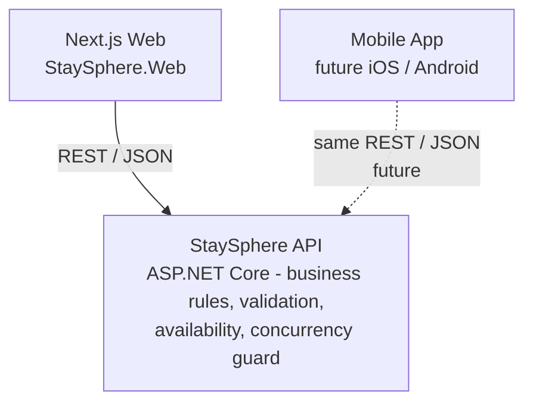

The current architecture already supports this:

* **Business rules live only in the backend.** Availability, capacity, date-overlap,
  pricing, reference generation, and the concurrency guard are in
  Application/Domain - a mobile client would get identical behaviour by calling the
  same endpoints.
* **API contracts are client-independent.** The API defines its own request/response
  records (`CreateReservationRequest`, `RoomDto`, `ReservationConfirmation`) with
  plain camelCase JSON and calendar-date strings. Nothing in the contract assumes a
  browser or Next.js. There is no shared server code between the web app and the API.
* **The web frontend has no privileged access.** It uses the same public HTTP surface
  a mobile app would; `NEXT_PUBLIC_API_BASE_URL` just points at that surface.
* **A mobile client should replicate only *shape* validation** (the equivalent of
  `src/lib/validation.ts`) for fast feedback, and must treat the backend as
  authoritative - exactly as the web frontend does. It must not re-implement
  availability or capacity logic.

Not in scope now: the mobile app itself, auth, push notifications, offline caching.

---

## Section 18 - Architectural Decisions

| # | Decision | Reason | Trade-off |
|---|----------|--------|-----------|
| 1 | **Lightweight layered architecture**, 4 projects (+ tests), plain application services | Matches the brief; the domain is small; keeps dependency direction explicit and the Domain framework-free | More projects than a single-assembly app; justified by the testability and boundary clarity it buys |
| 2 | **No CQRS / MediatR / generic repository / unit-of-work** | They add indirection over EF Core without solving a real problem at this size | Teams expecting those patterns must read the code to see the simpler shape is deliberate |
| 3 | **`IStaySphereDbContext` abstraction in Application**, implemented by the EF `DbContext` | Keeps `Infrastructure -> Application` direction; lets services be tested without the SQLite provider; still uses EF Core directly | Application takes a dependency on `Microsoft.EntityFrameworkCore` (not the provider) - a pragmatic compromise vs a pure repository layer |
| 4 | **`DateRange` value object owns all overlap logic**, mapped as an EF owned type | The brief forbids scattering date logic; one definition serves both the search SQL and the booking re-check | Owned-type + `DateOnly` mapping is a little EF nuance to understand |
| 5 | **Price & capacity on `RoomType`, not `Room`; `Reservation.TotalPrice` is a snapshot** | All rooms of a type share these attributes; a price change must not rewrite history | Slightly more navigation (`Room.RoomType.PricePerNight`) in queries |
| 6 | **Reservations reference a physical `Room`** | Availability is a property of an inventory unit; enables correct per-unit availability | Search returns one row per free room; a category view requires client-side grouping by `roomTypeId` |
| 7 | **Double-booking guard = `BEGIN IMMEDIATE` + authoritative re-check** inside the transaction; `DbUpdateException` at commit -> 409 | EF's default deferred `BEGIN` leaves a check-then-insert race; `BEGIN IMMEDIATE` takes the write lock up front | SQLite single-writer throughput; under heavy contention a loser may hit `SQLITE_BUSY`. Acceptable for this scope |
| 8 | **Money stored as integer cents** via a value converter | SQLite has no decimal; EF's default (TEXT) sorts lexicographically and breaks `ORDER BY price` | Every money read/write goes through the converter; `*Cents` column names |
| 9 | **Booking reference = `STAY-` + 8 Crockford base32**, CSPRNG, uniqueness-checked, unique index | Public id must be non-sequential, unguessable, and readable aloud | Tiny collision-retry loop (max 5) in the service |
| 10 | **Centralized error handling via one middleware** + `InvalidModelStateResponseFactory` | One error envelope, one status-mapping place; controllers stay thin | All error semantics concentrated in one file - intentional |
| 11 | **Catalog seeded in migration (`HasData`); extra rooms via idempotent JSON seeder; sample reservations date-relative at startup** | Migrations must be deterministic and file-independent; date-relative data can't be expressed in `HasData` | Two seeding mechanisms to know about; startup does a little work each boot (idempotent) |
| 12 | **No authentication** | Explicitly out of scope for the guest booking experience | Any future account features need an auth story added |
| 13 | **No microservices, message broker, Redis, distributed lock, K8s** | Small full-stack system; engineering judgment is shown by staying simple | Not horizontally scalable as-is; documented as a known limitation |
| 14 | **Next.js App Router, Server Components by default, Client Components only for `SearchForm` / `BookingForm`** | Data fetching on the server, minimal client JS, URL as search state | The one browser-side call (booking POST) needs CORS configured |
| 15 | **API is the sole client boundary; contracts are Next.js-independent** | Enables the future mobile client with zero backend change | Some DTO duplication between API contracts and frontend `types.ts` (kept in sync by hand) |

(Numbering follows `Docs/decisions.md`; items 12-15 summarize choices stated across
`CLAUDE.md` and the code.)

---

## Section 19 - Non-Functional Considerations

* **Maintainability:** small, cohesive classes; one responsibility each; business
  rules isolated from HTTP and EF; ~4 s backend test run, deterministic frontend
  suite. Lightweight docs in `Docs/`.
* **Extensibility:** new endpoints = new thin controller + application service; new
  error types = one middleware arm; new rooms/amenities via JSON seed without a
  migration; the EF model can move to another RDBMS without touching
  Application/Domain.
* **Testability:** no static/global mutable state; `IClock` and
  `IBookingReferenceGenerator` injected; `IStaySphereDbContext` lets services run
  against a test database; `Program` is `public partial` for `WebApplicationFactory`.
* **Performance:** search is a single SQL query with supporting indexes
  (`RoomId+Status`, `CheckIn+CheckOut`); no in-memory filtering; `AsNoTracking` on
  read paths; frontend uses Server Components + `cache: "no-store"` for volatile
  data. Booking cost is dominated by the serialized transaction.
* **Validation:** shape checks on the client for feedback; authoritative field +
  business validation on the server; domain invariants as the last line inside
  factories.
* **Error handling:** one consistent envelope with `traceId`; 409 distinguishable
  from 500; internal exception detail never leaked to clients.
* **Logging:** structured logs for startup, reservation attempts, confirmations
  (with reference + total), booking conflicts (warning), and unhandled exceptions
  (error, with traceId). No external observability platform.
* **Security:** no secrets in the repo; configuration via `appsettings` / env vars;
  all SQL is parameterized through EF (no string concatenation); every request input
  validated server-side; CORS restricted to configured origins; booking reference is
  a CSPRNG value, not a sequential id; no auth by design (documented).
* **Scalability limitations (documented, not hidden):** SQLite single-writer;
  no row locking; busy-timeout instead of a queue; vertical scaling only. The
  documented path is PostgreSQL/SQL Server + a range/exclusion constraint or
  `SERIALIZABLE` + retry, with no change to Application/Domain code.

---

## Section 20 - Request/Response Trace (one reservation in detail)

**Example:** `POST /api/reservations`

```json
{
  "roomId": 6,
  "checkIn": "2026-09-20",
  "checkOut": "2026-09-23",
  "guestCount": 2,
  "guestName": "Jordan Blake",
  "guestEmail": "jordan.blake@example.com",
  "specialRequests": "High floor if possible."
}
```

| Step | Component / method | What happens |
|------|--------------------|--------------|
| 1 | `BookingForm.handleSubmit` (browser) | `validateBooking(form)` (shape only) passes; re-entry guard checks `status`; `status = "submitting"` |
| 2 | `BookingForm` builds the payload | `{ roomId: room.roomId, checkIn/checkOut/guestCount: criteria, guestName/guestEmail/specialRequests: form }` |
| 3 | `createReservation(input)` -> `request()` (`src/lib/api.ts`) | `fetch(`${API_BASE_URL}/api/reservations`, { method: POST, headers: Accept + Content-Type, cache: "no-store", body: JSON })` |
| 4 | ASP.NET Core pipeline | `ExceptionHandlingMiddleware` wraps the call; CORS applied; model binding maps the body to `CreateReservationRequest` (binding failure would emit `ValidationFailed` via `InvalidModelStateResponseFactory`) |
| 5 | `ReservationsController.Create` | Maps the request to `CreateReservationCommand` and calls `IReservationService.CreateAsync` |
| 6 | `ReservationService.ValidateRequest` | Accumulates field errors (`ValidationErrors`); all valid -> constructs `new DateRange(2026-09-20, 2026-09-23)` (`Nights = 3`) |
| 7 | `ReservationService.CreateAsync` - load | `_db.Rooms.Include(RoomType -> RoomTypeAmenities -> Amenity).FirstOrDefaultAsync(r => r.Id == 6)`; null -> `NotFoundException` (404) |
| 8 | capacity check | `guestCount (2) <= room.RoomType.MaxGuests` ? else `ValidationException("guestCount")` (400) |
| 9 | `_db.BeginImmediateTransactionAsync()` | Opens the `SqliteConnection`, `BEGIN IMMEDIATE` (RESERVED write lock), attaches the transaction to EF |
| 10 | authoritative re-check | `_db.Reservations.AnyAsync(RoomId == 6 && Status == Confirmed && Stay.Start < 2026-09-23 && 2026-09-20 < Stay.End)`; true -> `RoomUnavailableException` (409) |
| 11 | `GenerateUniqueReferenceAsync` | `IBookingReferenceGenerator.Generate()` -> `"STAY-9F3KQ2TµY"`-style; `AnyAsync` uniqueness check; retry up to 5x |
| 12 | `Reservation.Create(room, stay, 2, "Jordan Blake", "jordan.blake@example.com", "High floor if possible.", reference, clock.UtcNow)` | Enforces invariants; trims strings; `Status = Confirmed`; `TotalPrice = RoomType.CalculatePrice(3)` |
| 13 | persist | `_db.Reservations.Add(reservation)`; `SaveChangesAsync()` -> `INSERT`; `transaction.CommitAsync()` -> `COMMIT` (lock released). `DbUpdateException` here -> `RoomUnavailableException` (409) |
| 14 | `ReservationConfirmation.FromEntity(reservation)` | Projects the entity + room/type/amenities to the response record (amenities alphabetized) |
| 15 | `ReservationsController` | `CreatedAtAction(nameof(GetByReference), new { reference }, confirmation)` -> **201** + `Location: /api/reservations/STAY-...` |
| 16 | `request()` (browser) | Response OK -> parses JSON -> returns `ReservationConfirmation` |
| 17 | `BookingForm` | `status = "done"`; `router.push(`/booking/confirmation/${encodeURIComponent(bookingReference)}`)` (button stays disabled through navigation) |
| 18 | `booking/confirmation/[reference]/page.tsx` (Server Component) | `await getReservation(reference)` -> `GET /api/reservations/{reference}` -> `ReservationService.GetByReferenceAsync` (`AsNoTracking`, includes room/type/amenities) -> renders reference, guest, stay, nights, guests, price total, special requests |

**Response body (201):**

```json
{
  "bookingReference": "STAY-9F3KQ2WY",
  "guestName": "Jordan Blake",
  "guestEmail": "jordan.blake@example.com",
  "specialRequests": "High floor if possible.",
  "roomId": 6,
  "roomNumber": "301",
  "roomType": "Family Suite",
  "description": "Two-room suite with a king bed and a separate lounge with a sofa bed.",
  "amenities": ["Air conditioning", "Balcony", "Bathtub", "Coffee machine", "Flat-screen TV", "Free Wi-Fi", "Safe"],
  "imageUrl": "/images/rooms/family-suite.svg",
  "checkIn": "2026-09-20",
  "checkOut": "2026-09-23",
  "nights": 3,
  "guestCount": 2,
  "pricePerNight": 249.00,
  "totalPrice": 747.00,
  "status": "Confirmed",
  "createdAtUtc": "2026-08-28T09:12:41.20+00:00"
}
```

---

## Appendix - Verification Notes

Every component named in this document was checked against the repository:

* **API routes** verified in `RoomsController` (`api/rooms/search`,
  `api/rooms/{roomId:int}`) and `ReservationsController` (`api/reservations`,
  `api/reservations/{reference}`), plus the Development-only `/` -> `/swagger`
  redirect in `Program.cs`.
* **Frontend routes** verified in `src/app`: `/`, `/rooms`, `/rooms/[roomId]`,
  `/booking/[roomId]`, `/booking/confirmation/[reference]`, `not-found.tsx`,
  `error.tsx`, and per-segment `loading.tsx`.
* **Reservation flow** verified line-by-line against
  `ReservationService.CreateAsync`, `ValidateRequest`,
  `GenerateUniqueReferenceAsync`, `Reservation.Create`,
  `IStaySphereDbContext.BeginImmediateTransactionAsync`
  (`StaySphereDbContext`), and `ReservationsController.Create`.
* **Domain entities** verified against `StaySphere.Domain/*.cs` and the EF
  configurations + `20260827174159_InitialCreate` migration (tables, columns,
  indexes, FKs, delete behaviours, seed data).
* **Dependency direction** verified from the `.csproj` `ProjectReference` /
  `PackageReference` sets (Domain has no package refs; Application references
  `Microsoft.EntityFrameworkCore` but not the Sqlite provider or Infrastructure).
* **Error / status codes** verified against `ExceptionHandlingMiddleware`'s `switch`
  and `Program.cs`'s `InvalidModelStateResponseFactory`, cross-checked with
  `src/lib/api.ts` (`ApiError`, status 0 for network).
* **Concurrency behaviour** verified against `StaySphereDbContext.BeginImmediateTransactionAsync`,
  `ReservationService.CreateAsync`, and `DoubleBookingConcurrencyTests`.

### Could not be fully verified from code

* **Deployment / hosting** - no Dockerfile, CI, or IaC in the repo. Section 2's
  deployment notes are inferred from `appsettings*.json`, `launchSettings.json`,
  `.env.example`, and `Program.cs` only.
* **Exact test counts** (~175 backend, ~106 frontend) are quoted from
  `Docs/testing.md`, not re-run for this document.
* **API base URL used in practice** - `src/lib/config.ts` defaults to
  `http://localhost:7265` while `.env.example` / `.env.local` set
  `http://localhost:5276`; both point at the same dev API. The effective value is
  whatever `NEXT_PUBLIC_API_BASE_URL` is set to at build/run time.
* **Playwright E2E** - referenced as the planned next step in `Docs/testing.md`; no
  Playwright config or specs exist yet.
```
